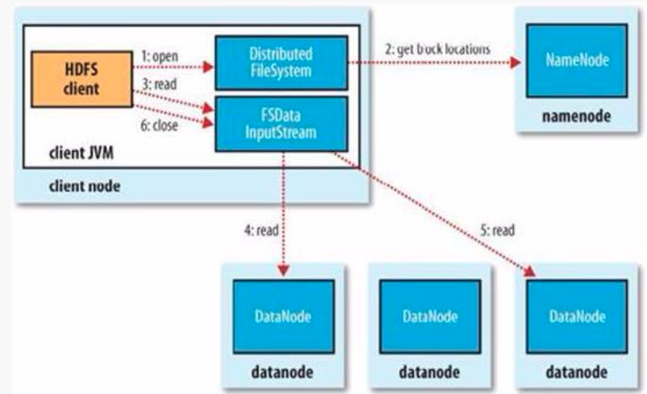
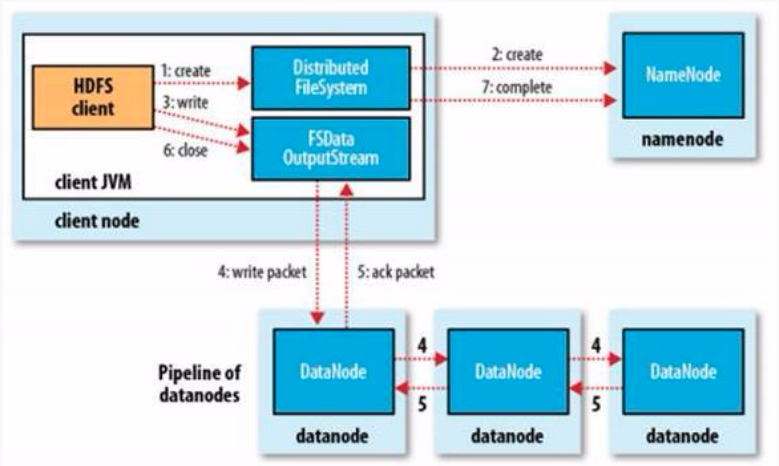

# HDFS的读写流程
 
### HDFS读流程

- Client通过`FileSystem.open()`方法，去与`NameNode`进行`rpc`通信，返回该文件的部分或全部的`block`列表(**也包含该列表各block的分布在Datanode地址的列表**)，也就是返回**`FSDataInputStream`**对象
- Client调用`FSDataInputStream.read()`方法

	+ 与第一个块的最近的Datanode进行read，读取完毕后会`check`，若sucessful，会关闭与当前`Datanode`通信；若`check file`，会记录失败的块和Datanode信息，下次就不会读取，那么就会去该块的第二个`Datanode`地址读取；
	+ 然后去第二个块的最近的Datanode上的进行读取,check后,会关闭与此datanode的通信；
	+ 假如block列表读取完了,文件还未结束,那么FileSystem会从Namenode获取下一批的block的列表；

- Client调用`FSDataInputStream.close()`方法，关闭输入流

### HDFS写流程

