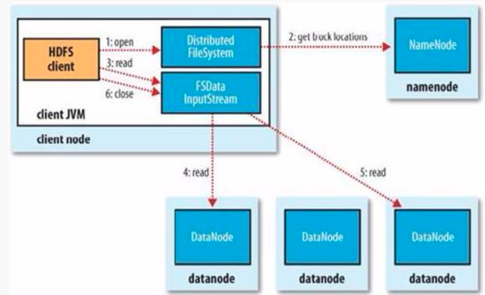
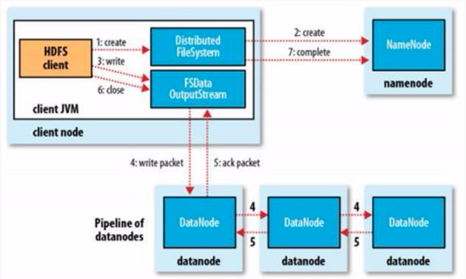

# HDFS的读写流程
 
### HDFS读流程

- Client通过`FileSystem.open()`方法，去与`NameNode`进行**`rpc`**通信，返回该文件的部分或全部的`block`列表(也包含该列表各block的分布在Datanode地址的列表)，也就是返回**`FSDataInputStream`**对象
- Client调用`FSDataInputStream.read()`方法

	+ 与第一个块的最近的Datanode进行read，读取完毕后会`check`，若sucessful，会关闭与当前`Datanode`通信；若`check file`，会记录失败的块和Datanode信息，下次就不会读取，那么就会去该块的第二个`Datanode`地址读取；
	+ 然后去第二个块的最近的Datanode上的进行读取,check后,会关闭与此datanode的通信；
	+ 假如block列表读取完了,文件还未结束,那么FileSystem会从Namenode获取下一批的block的列表；

- Client调用`FSDataInputStream.close()`方法，关闭输入流

 
 

### HDFS写流程

- Client调用`FileSystem.create()`方法，去与`Namenode`进行**`rpc`**通信，`check`该路径的文件**是否存在以及有没有权限**创建该文件，假如ok，就创建一个新文件，但是并**不关联任何block**，返回一个**`FSDataOutputStream`**对象；假如not ok，就返回错误信息,所以写代码要**try-catch**
- Client调用`FSDataOutputStream.write()`方法
	
	+ 将第一个块写入第一个`Datanode`，第一个`Datanode`写完传给第二个节点，第二个写完传给第三节点，当第三个节点写完返回一个**`ackpacket`**给第二个节点，第二个返回一个**`ackpacket`**给第一个节点，第一个节点返回**`ackpacket`**给`FSDataOutputStream`对象，意思标识第一个块写完，副本数为3；然后剩余的块依次这样写

- 当向文件写入数据完成后,Client调用`FSDataOutputStream.close()`方法,关闭输出流,`flush`缓存区的数据包;
- 再调用`FileSystem.complete()`方法,告诉`Namenode`节点写入成功

