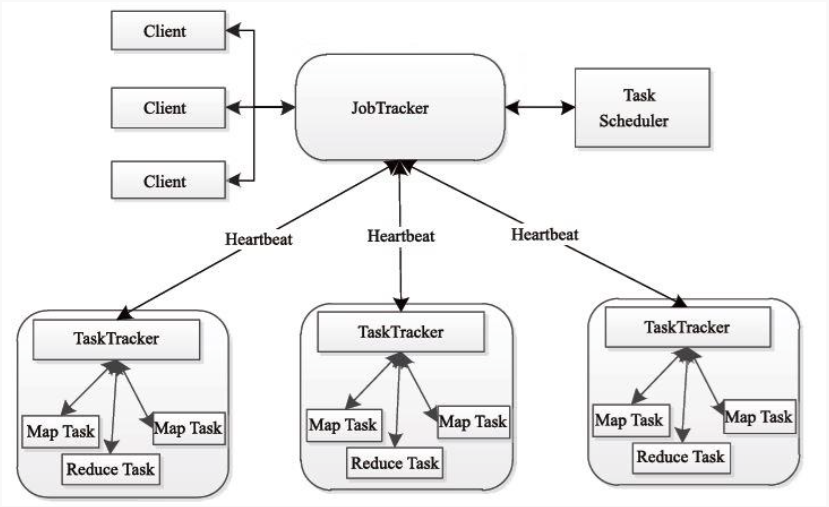
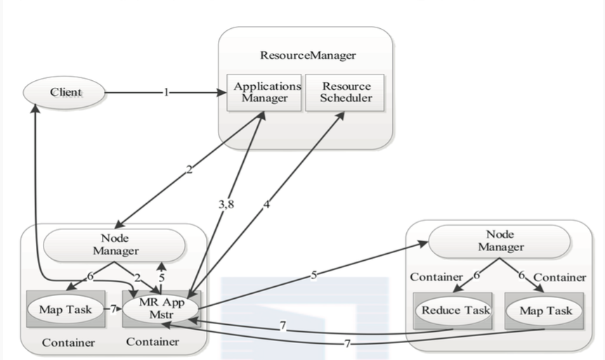

# MapReduce架构设计

### MapReduce1架构设计



主要有四个组成部分

- Client: 客户端
- JobTracker: 负责资源监控和作业调度
		
	+ JobTracker监控所有TaskTracker与job的健康状况，一旦发现失败，就将相应的任务转移到其他节点
	+ JobTracker会跟踪任务的执行进度、资源使用量等信息，并将这些信息告诉任务调度器，而调度器会在资源出现空闲时，选择合适的任务使用这些资源
	+ 在Hadoop中，任务调度器是一个可插拔的模块，用户可以根据自己的需要设计相应的调度器

- TaskTracker

	+ TaskTracker会周期性的通过Heartbeat将本节点上资源的使用情况和任务的运行进度汇报给JobTracker
	+ 接收JobTracker发送过来的命令并执行相应的操作
	+ TaskTracker使用"slot"等量划分本节点上的资源量

- Task: 分为Map Task和Reduce Task,均由TaskTracker启动

	+ Map Task: 映射任务 
	+ Reduce Task: 归约任务


### MapReduce2架构设计

	也叫做
	MapReduce提交到Yarn的工作流程
	Yarn的工作流程
	Yarn的架构设计



1. Client向YARN中提交应用程序，其中包括ApplicationMaster程序、启动ApplicationMaster的命令、用户程序等
2. ResourceManger为该应用程序分配第一个Container，并与对应的Node-Manger通信，要求它在这个Container中启动应用程序的ApplicationMaster
3. ApplicationMaster首先向ResourceManger注册，这样用户可以直接通过ResourceManger查看应用程序的运行状态，然后它将为各个任务申请资源，并监控它的运行状态，直到运行结束，即重复步骤4~7
4. ApplicationMaster采用轮询的方式通过RPC协议向ResourceManager申请和领取资源
5. 一旦ApplicationMaster申请到资源后，便与对应的NodeManager通信，要求它启动任务
6. NodeManager为任务设置好运行环境(包括环境变量、JAR包、二进制程序等)后，将任务启动命令写到一个脚本中，并通过运行该脚本启动任务
7. 各个任务通过某个RPC协议向ApplicationMaster汇报自己的状态和进度,以让ApplicationMaster随时掌握各个任务的运行状态，从而可以在任务失败时重新启动任务。在应用程序运行过程中，用户可随时通过RPC向ApplicationMaster查询应用程序的当前运行状态
8. 应用程序运行完成后，ApplicationMaster向ResourceManager注销并关闭自己

```
当用户向YARN中提交一个应用程序后,YARN将分两个阶段运行该应用程序:
a. 第一个阶段是启动ApplicationMaster;
b. 第二个阶段是由ApplicationMaster创建应用程序,为它申请资源,并监控它的整个运行过程,直到运行完成
```


 