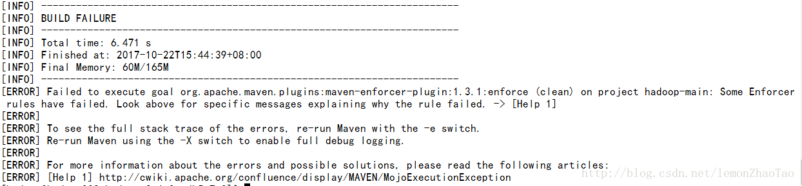
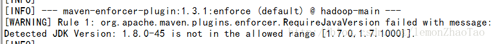
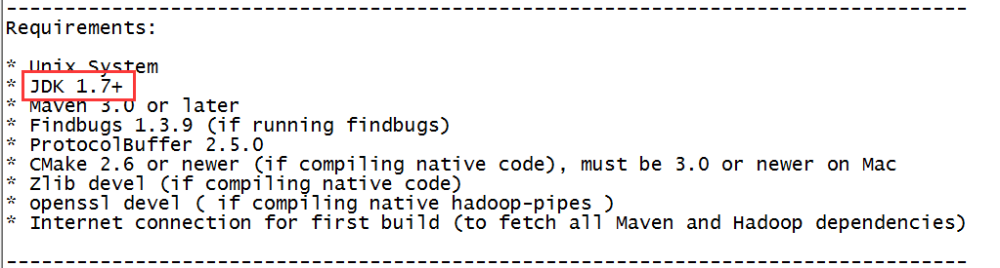
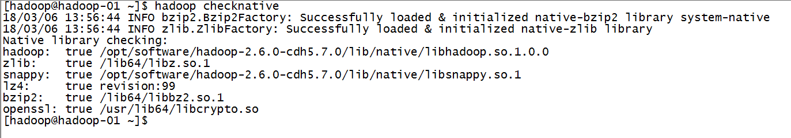

# hadoop2.6.0-cdh5.7.0

编译hadoop2.6.0-cdh5.7.0，参考[1](https://github.com/dwz1011/notes/blob/master/big_data/Hadoop_Env_Install/step-04.md)，[2](https://github.com/dwz1011/notes/blob/master/big_data/Hadoop_Env_Install/step-06.md)，[3](https://github.com/dwz1011/notes/blob/master/big_data/Hadoop_Env_Install/step-06.md)

### 遇到的问题



修改了编译命令为：

```
[root@hadoop-01 hadoop-2.6.9-cdh5.7.0]$ mvn clean package -Denforcer.skip=true -DskipTests -Pdist,native -Dtar
```



查阅hadoop-2.6.0-cdh5.7.0源码包解压之后的BUILDING.txt文件,发现


然后试着换成JDK1.7的版本

继续编译

```
[root@hadoop-01 hadoop-2.6.9-cdh5.7.0]$ mvn clean package -Pdist,native -DskipTests -Dtar
```

### native 问题

编译成功后，验证本地库是否加载成功：`hadoop checknative`，发现均为false

我又把那些依赖包又装了一下，

```
yum -y install snappy libsnappy-dev
yum -y install bzip2 libbz2-dev
yum -y install libjansson-dev
```


安装 snappy-1.1.3.tar.gz

1. 下载 `wget https://github.com/google/snappy/releases/download/1.1.3/snappy-1.1.3.tar.gz`
2. tar xf snappy-1.1.3.tar.gz
3. cd snappy-1.1.3
4. ./configure
5. make && make install
6. 查看snappy是否安装完成：`ll /usr/local/lib/ | grep snappy`

之后再次编译

编译成功后，将lib/native目录下文件拷贝到对应的安装目录下的native目录中

执行验证 `hadoop checknative`




