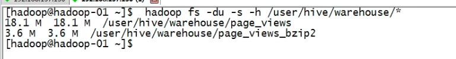
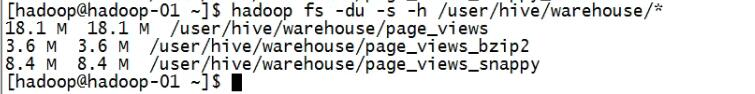

# Hive数据压缩

- 压缩的好处

	1. 减少存储磁盘空间
	2. 降低IO(网络的IO和磁盘的IO)
	3. 加快数据在磁盘和网络中的传输速度，从而提高系统的处理速度

- 坏处：
    1. 由于使用数据时，需要先将数据解压，加重CPU负荷

- 常用的压缩技术

|压缩格式|  工具 | 算 法 | 扩 展 名 | 是否支持分割 | Hadoop编码/解码器 |
|:-----:|:----:|:-----:|:------:|:-----------:|:-----------:|
|DEFLATE| N/A | DEFLATE|.deflate|   No       |org.apache.hadoop.io.compress.DefaultCodec|
| gzip | gzip | DEFLATE|  .gz   |   No       |org.apache.hadoop.io.compress.GzipCodec|
| bzip2| bzip2| bzip2  |  .bz2  |   Yes      |org.apache.hadoop.io.compress.BZip2Codec|
| LZO  | Lzop | LZO    |  .lzo  |   No       |com.hadoop.compression.lzo.LzoCodec|
| LZ4  | N/A  | LZ4    |  .lz4  |   No       |org.apache.hadoop.io.compress.Lz4Codec|
|Snappy| N/A  | Snappy | .snappy|Yes(if index)|org.apache.hadoop.io.compress.SnappyCodec|

### hive参数设置

- 可选配置配置

		org.apache.hadoop.io.compress.GzipCodec,
		org.apache.hadoop.io.compress.DefaultCodec,
		org.apache.hadoop.io.compress.BZip2Codec,
		com.hadoop.compression.lzo.LzoCodec,
		org.apache.hadoop.io.compress.Lz4Codec,
		org.apache.hadoop.io.compress.SnappyCodec

- 设置是否压缩  
		
		hive.exec.compress.output

- 设置压缩Reduce类型输出 

		mapreduce.output.fileoutputformat.compress.codec 

- 设置中间Map压缩类型

		hive.intermediate.compression.codec 
		
		
		
### Example		
 
- core-site.xml

		<property>
			<name>io.compression.codecs</name>
			<value>
			org.apache.hadoop.io.compress.GzipCodec,
			org.apache.hadoop.io.compress.DefaultCodec,
			org.apache.hadoop.io.compress.BZip2Codec,
			com.hadoop.compression.lzo.LzoCodec,
			org.apache.hadoop.io.compress.Lz4Codec,
			org.apache.hadoop.io.compress.SnappyCodec
			</value>
		</property>

- mapred-site.xml

		<property>
			<name>mapreduce.output.fileoutputformat.compress</name>
			<value>true</value>
		</property>
		
		<property>
			<name>mapreduce.output.fileoutputformat.compress.codec</name>
			<value>org.apache.hadoop.io.compress.BZip2Codec</value>
		</property>

原表数据大小

-  以Bzip2压缩格式进行压缩

		hive> SET hive.exec.compress.output=true;
		hive> SET mapreduce.output.fileoutputformat.compress.codec=org.apache.hadoop.io.compress.BZip2Codec;
		hive> create table page_views_bzip2
    		> ROW FORMAT DELIMITED FIELDS TERMINATED BY "\t"
    		> as select * from page_views;
    		
    
    
- 以Snappy压缩格式进行压缩

		hive> SET hive.exec.compress.output=true;
		hive> SET mapreduce.output.fileoutputformat.compress.codec=org.apache.hadoop.io.compress.SnappyCodec;
		hive> create table page_views_snappy
			> ROW FORMAT DELIMITED FIELDS TERMINATED BY "\t"
			> as select * from page_views;
			
	

		
		
		
		
		
		
		
		
		
		
		
		
		
		
		
		
		
		
		
		
		
		
		