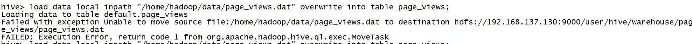
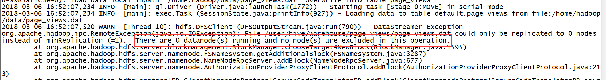
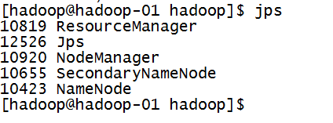
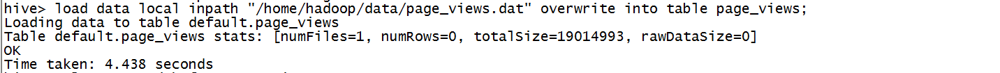

# Hive 错误集

### 1. 创建表没问题，加载数据失败

查看日志发现

猜想可能datanode没有启动，jps查看

果然datanode没有启动起来

然后查看datanode的日志，发现datanode的clusterID和namenode的clusterID不一致

**解决：**

- 进入datanode的dfs.datanode.data.dir的current目录(默认在/tmp/hadoop-hadoop/dfs/data/current)
- 修改其中的VERSION文件，将clusterID改为和namenode的clusterID一致的
- 重启hadoop

再次加载数据，成功

