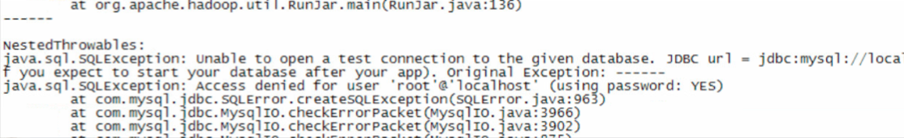

# Hive安装及部署

- Hive的产生背景 

		1) MR编程不便性
		2) 传统RDBMS人员的需要

- Hive是构建在Hadoop之上的数据仓库
	
		数据存储在HDFS之上
		计算是使用MR
		弹性：线性扩展
		
- Hive底层的执行引擎：MapReduce、Tez、Spark

- Hive常用于：离线批处理

- 为什么要使用Hive

		1) 简单易用
		2) 弹性
		3) 统一的元数据管理

-----------------------------------------------------------------------

1. 下载hive-1.1.0-cdh5.7.0.tar.gz，并解压

		[hadoop@hadoop-01 software]$ wget http://archive.cloudera.com/cdh5/cdh/5/hive-1.1.0-cdh5.7.0.tar.gz
		[hadoop@hadoop-01 software]$ tar -xzvf hive-1.1.0-cdh5.7.0.tar.gz -C ~/app/
		
2. 配置环境变量并生效

		 [hadoop@hadoop-01 software]$ vi ~/.bash_profile
		 export HIVE_HOME=/home/hadoop/app/hive-1.1.0-cdh5.7.0
		 export PATH=$HIVE_HOME/bin:$PATH
		 [hadoop@hadoop-01 software]$ source ~/.bash_profile
		 
3. Hive部署
		
		[hadoop@hadoop-01 software]$ cd ../app/hive-1.1.0-cdh5.7.0/conf/
		[hadoop@hadoop-01 conf]$ cp hive-env.sh.template  hive-env.sh
		[hadoop@hadoop-01 conf]$ vi hive-env.sh
		# 修改HADOOP_HOME
		HADOOP_HOME=/home/hadoop/app/hadoop-2.6.0-cdh5.7.0
		
	- 默认情况下，Hive元数据保存在内嵌的`Derby`数据库中，只能允许一个会话连接，只适合简单的测试
	- 为了支持多用户多会话，则需要一个独立的元数据库，我们使用`MySQL`作为元数据库
	
			# 新建hive-site.xml
			[hadoop@hadoop-01 conf]$ touch hive-site.xml
			[hadoop@hadoop-01 conf]$ vi hive-site.xml
			<?xml version="1.0"?>
			<?xml-stylesheet type="text/xsl" href="configuration.xsl"?>
			 
			<configuration>   
			    <property>
			        <name>javax.jdo.option.ConnectionURL</name>
			        <value>jdbc:mysql://localhost:3306/ruoze_hive?createDatabaseIfNotExist=true</value>
			    </property>
			 
			    <property>
			        <name>javax.jdo.option.ConnectionDriverName</name>
			        <value>com.mysql.jdbc.Driver</value>
			    </property>
			 
			    <property>
			        <name>javax.jdo.option.ConnectionUserName</name>
			        <value>root</value>
			    </property>
			 
			    <property>
			        <name>javax.jdo.option.ConnectionPassword</name>
			        <value>root</value>   // 这里的用户和密码要与MySQL的一直
			    </property>
			</configuration>
			
		拷贝MySQL驱动包(`mysql-connector-java.jar`)到`$HIVE_HOME/lib/`
		
		
**遇到的问题**

1. 我的MySQL一开始root用户没有设置密码，当我配置hive-site.xml(内容跟上述一致)文件，报错

解决：设置MySQL的root用户的密码

		mysql> update user set password=password('root') where user='root';
		mysql> flush privileges;
		
2. 再次使用hive的时候依然报错，`name node is in safe mode`

	解决：
		
		[hadoop@hadoop-01 hive-1.1.0-cdh5.7.0]$ hdfs dfsadmin -safemode leave
		
再次启动
	

	
		
	

		

		