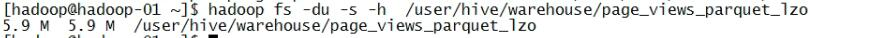

# Hive数据存储

### 行式存储和列式存储

行式存储

	特点：
		保证一条记录里面的所有字段能够存放在同一个hdfs的block里
	
	优点：
		当查询所有(select * from tbname)时，能直接查询出来
		
	缺点：
		不同列的字段类型不同，压缩性能差，空间利用率差
		只查询某几列数据的时候，必须先把所有数据读取进来，在提取所需的几列，结果会增加磁盘IO，效率低
	
列式存储
	
	优点：
		每一列的数据类型是一样的，所有可以采用一定压缩方式，压缩性能好
		只查询某几列数据的时候，对于不需要的列，可以直接跳过
	
	缺点：
		当查询所有(select * from tbname)时，对于行的数据必然会重组
		
### 存储类型		

- TestFile(行式存储，默认)

	缺点：所有字段都是string类型，解析麻烦
	
	查看表的详细信息： `desc formatted tbname `
	
	
	
	
- SequenceFile(行式存储)

	
	
	类似于二进制，是key-value存储的
	
	压缩只能压缩value，对比于TestFile，多了一些冗余信息，但是随机读写要好一些
	
- RcFile(行列混合) --> Available in Hive `0.6.0` and later

		
	
	先行后列	
	
	Row Group 只有4M
	
- ORCFile(优化过后的存储) --> Available in Hive `0.11.0` and later

	
	
	orcFile是对rcFile的优化，其将文件分为多个stripe，默认每个stripe为250M，在stripe中默认对每10000行进行一个索引（index data）。这个索引记录了这些行中的max和min，对于查询，有更明显的优化

	指定ORC文件格式
		
		1. CREATE TABLE ... STORED AS ORC
		2. ALTER TABLE ... [PARTITION partition_spec] SET FILEFORMAT ORC
		3. SET hive.default.fileformat=Orc

	参数在TBLPROPERTIES中配置
	
	|    		key					|	defult	|        notes         |
	|:------------------------:|:------:|:---------------------------|
	|	  orc.compress			|  ZLIB   |high level compression (one of NONE, ZLIB, SNAPPY) |
	|    orc.compress.size     | 262144  |number of bytes in each compression chunk|
	|    orc.stripe.size       |67108864|number of bytes in each strip|
	|   orc.row.index.stride   | 10000 |number of rows between index entries (must be >= 1000)|
	|   orc.create.index       | true  |whether to create row indexes|
	| orc.bloom.filter.columns |""|comma separated list of column names for which bloom filter should be created|
	|    orc.bloom.filter.fpp  | 0.05   |false positive probability for bloom filter (must >0.0 and <1.0)|
	
	
- Parquet(列式存储) --> Available in Hive `0.13.0` and later

	
	
### 相同数据，分别以TestFile、SequenceFile、RcFile、ORC存储的比较
	
**TestFile(默认)**
	

	
**SequenceFile**

	create table page_views_seq( 
	track_time string, 
	url string, 
	session_id string, 
	referer string, 
	ip string, 
	end_user_id string, 
	city_id string 
	)ROW FORMAT DELIMITED FIELDS TERMINATED BY “\t” 
	STORED AS SEQUENCEFILE;
	
	insert into table page_views_seq select * from page_views; 
		

	
**RcFile**
	
	create table page_views_rcfile(
	track_time string,
	url string,
	session_id string,
	referer string,
	ip string,
	end_user_id string,
	city_id string
	)ROW FORMAT DELIMITED FIELDS TERMINATED BY "\t"
	STORED AS RCFILE;
		
	insert into table page_views_rcfile select * from page_views; 

	
**ORC**
	
	create table page_views_orc
	ROW FORMAT DELIMITED FIELDS TERMINATED BY "\t"
	STORED AS ORC 
	TBLPROPERTIES("orc.compress"="NONE")
	as select * from page_views;
		

	
**ORC+Zlip**

	create table page_views_orc_zlib
	ROW FORMAT DELIMITED FIELDS TERMINATED BY "\t"
	STORED AS ORC 
	TBLPROPERTIES("orc.compress"="ZLIB")
	as select * from page_views;
	

**Parquet**
	
	create table page_views_parquet
	ROW FORMAT DELIMITED FIELDS TERMINATED BY "\t"
	STORED AS PARQUET 
	as select * from page_views;

**Parquet+gzip**	

	set parquet.compression=gzip;
	create table page_views_parquet_gzip
	ROW FORMAT DELIMITED FIELDS TERMINATED BY "\t"
	STORED AS PARQUET 
	as select * from page_views;
	

**Parquet+Lzo**	

	1. 安装Lzo
	wget http://www.oberhumer.com/opensource/lzo/download/lzo-2.06.tar.gz
	tar -zxvf lzo-2.06.tar.gz
	cd lzo-2.06
	./configure -enable-shared -prefix=/usr/local/hadoop/lzo/
	make && make install
	cp /usr/local/hadoop/lzo/lib/* /usr/lib/
	cp /usr/local/hadoop/lzo/lib/* /usr/lib64/
	vi /etc/profile
	export PATH=/usr/local//hadoop/lzo/:$PATH
	export C_INCLUDE_PATH=/usr/local/hadoop/lzo/include/
	source /etc/profile
	
	2. 安装Lzop
	wget http://www.lzop.org/download/lzop-1.03.tar.gz
	tar -zxvf lzop-1.03.tar.gz
	cd lzop-1.03
	./configure -enable-shared -prefix=/usr/local/hadoop/lzop
	make  && make install
	vi /etc/profile
	export LD_LIBRARY_PATH=$LD_LIBRARY_PATH:/usr/lib64
	source /etc/profile

	3. ln -s /usr/local/hadoop/lzop/bin/lzop /usr/bin/lzop

	4. 测试lzop
	
		lzop xxx.log
		若生成xxx.log.lzo文件，则说明成功
	
	5. 安装Hadoop-LZO
	git或svn 下载https://github.com/twitter/hadoop-lzo
	cd hadoop-lzo
	mvn clean package -Dmaven.test.skip=true 
	tar -cBf - -C target/native/Linux-amd64-64/lib . | tar -xBvf - -C /opt/software/hadoop/lib/native/
	cp target/hadoop-lzo-0.4.21-SNAPSHOT.jar /opt/software/hadoop/share/hadoop/common/

	6.配置
	在core-site.xml配置
	<property>
		<name>io.compression.codecs</name>
		<value>
      		org.apache.hadoop.io.compress.GzipCodec,
      		org.apache.hadoop.io.compress.DefaultCodec,
      		org.apache.hadoop.io.compress.BZip2Codec,
      		org.apache.hadoop.io.compress.SnappyCodec,
      		com.hadoop.compression.lzo.LzoCodec,
      		com.hadoop.compression.lzo.LzopCodec
    	</value>
	</property>
	<property>
   		<name>io.compression.codec.lzo.class</name>
   		<value>com.hadoop.compression.lzo.LzoCodec</value>
	</property>
	
	在mapred-site.xml中配置
	<property> 
   		<name>mapreduce.map.output.compress.codec</name> 
    	<value>com.hadoop.compression.lzo.LzoCodec</value> 
	</property> 
	<property>
    	<name>mapred.child.env</name>
    	<value>LD_LIBRARY_PATH=/usr/local/hadoop/lzo/lib</value>
	</property>
	
	在hadoop-env.sh中配置
	export LD_LIBRARY_PATH=/usr/local/hadoop/lzo/lib
	
	
	hive 测试
	SET hive.exec.compress.output=true;  
	SET mapreduce.output.fileoutputformat.compress.codec=com.hadoop.compression.lzo.lzopCodec;
	SET mapred.output.compression.codec=com.hadoop.compression.lzo.LzopCodec; 



	create table page_views_parquet_lzo ROW FORMAT DELIMITED FIELDS TERMINATED BY "\t"
	STORED AS PARQUET
	TBLPROPERTIES("parquet.compression"="lzo")
	as select * from page_views; 
	

	
		

