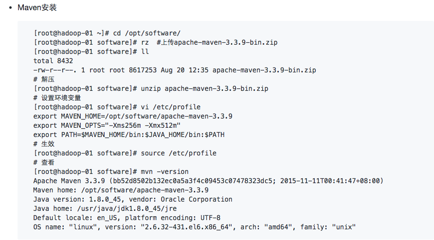

# Spark之安装

[参考官网](http://spark.apache.org/docs/latest/building-spark.html)

1. 需要安装Maven

	在Hadoop编译的时候已经安装了，参考
	

2. 下载spark的tar包，并解压

		[hadoop@hadoop-01 source]$ wget https://d3kbcqa49mib13.cloudfront.net/spark-2.2.0.tgz
		[hadoop@hadoop-01 source]$ tar -xzvf spark-2.2.0.tgz

3. 编辑dev/make-distribution.sh

		[hadoop@hadoop-01 spark-2.2.0]$ vi dev/make-distribution.sh
		注释
		#VERSION=$("$MVN" help:evaluate -Dexpression=project.version $@ 2>/dev/null | grep -v "INFO" | tail -n 1)
		#SCALA_VERSION=$("$MVN" help:evaluate -Dexpression=scala.binary.version $@ 2>/dev/null\
		#    | grep -v "INFO"\
		#    | tail -n 1)
		#SPARK_HADOOP_VERSION=$("$MVN" help:evaluate -Dexpression=hadoop.version $@ 2>/dev/null\
		#    | grep -v "INFO"\
		#    | tail -n 1)
		#SPARK_HIVE=$("$MVN" help:evaluate -Dexpression=project.activeProfiles -pl sql/hive $@ 2>/dev/null\
		#    | grep -v "INFO"\
		#    | fgrep --count "<id>hive</id>";\
		#    # Reset exit status to 0, otherwise the script stops here if the last grep finds nothing\
		#    # because we use "set -o pipefail"
		#    echo -n)
		添加
		VERSION=2.2.0
		SCALA_VERSION=2.11
		SPARK_HADOOP_VERSION=2.6.0-cdh5.7.0
		SPARK_HIVE=1

4. 编辑pom.xml

		[hadoop@hadoop-01 spark-2.2.0]$ vi pom.xml
		添加
		<repository>
		      <id>clouders</id>
		      <name>clouders Repository</name>
		      <url>https://repository.cloudera.com/artifactory/cloudera-repos/</url>
		</repository>

5. 安装(需要的时间比较久)

		[hadoop@hadoop-01 spark-2.2.0]$ ./dev/make-distribution.sh --name 2.6.0-cdh5.7.0 --tgz -Dhadoop.version=2.6.0-cdh5.7.0 -Phadoop-2.6 -Phive -Phive-thriftserver -Pyarn