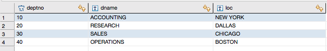
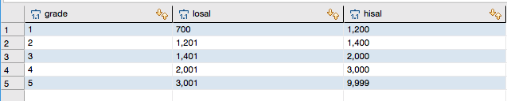
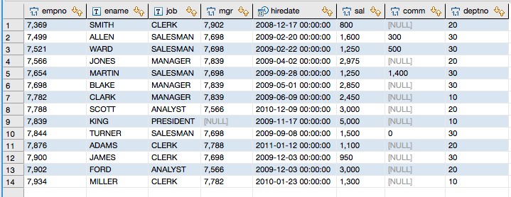
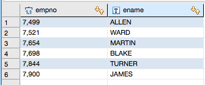
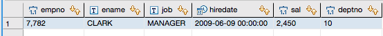
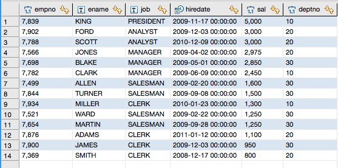
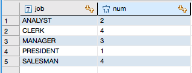
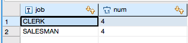
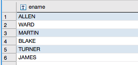
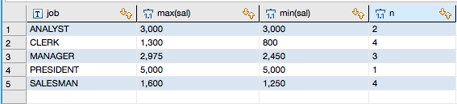

# MySQL查询之(部门、工资等级、员工)

假设现在有三个表(部门表，工资等级表，员工表)

部门表(dept)

	deptno部门编号
	dname部门名称
	loc地点

工资等级表(salgrade)

	grade 等级
	losal此等级的最低
	hisal此等级的最高

员工表(emp)

	empno员工号
	ename员工姓名
	job工作
	mgr上级编号
	hiredate受雇日期
	sal薪金
	comm佣金
	deptno部门编号

- 查询出部门编号为30的所有员工的编号和姓名

		select empno,ename from emp where deptno=30;
	
	
	
	
- 找出部门编号为10中所有经理，和部门编号为20中所有销售员的详细资料。

		select empno,ename,job,hiredate,sal,deptno 
		from emp where 
		(emp.job = 'MANAGER' and emp.deptno = 10) 
		or(emp.job = 'SALESMAN' and emp.deptno = 20);
	
	
	
- 查询所有员工详细信息，用工资降序排序，如果工资相同使用入职日期升序排序
	
		select empno,ename,job,hiredate,sal,deptno
		from emp
		order by emp.sal desc, emp.hiredate asc;
		
	
	
- 各种工作及从事此工作的员工人数
	
		select job,count(*) as num from emp group by job;
		
	
	
		如果再加上一个条件：员工人数大于3
		select job,count(*) as num from emp group by job having num>3;
	
	
	
		列出最低薪金大于1500的各种工作及从事此工作的员工人数
		select job,count(*) as num from emp group by job having min(sal)>1500;
	
	
	
- 列出在销售部工作的员工的姓名，假定不知道销售部的部门编号
	
		select e.ename from emp e where e.deptno=(select deptno from dept where dname='SALES');

	
	
- 查询每种工作的最高工资、最低工资、每种工作的人数
		
		select e.job,max(sal),min(sal),count(1) as n from emp e group by e.job;
	
	

	
	
	
	
	
	
	
	
	
	
	
	
	
	
	
	
	
	
	
