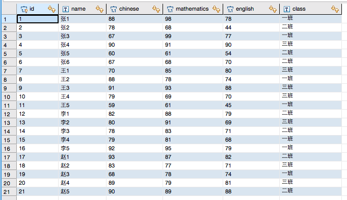
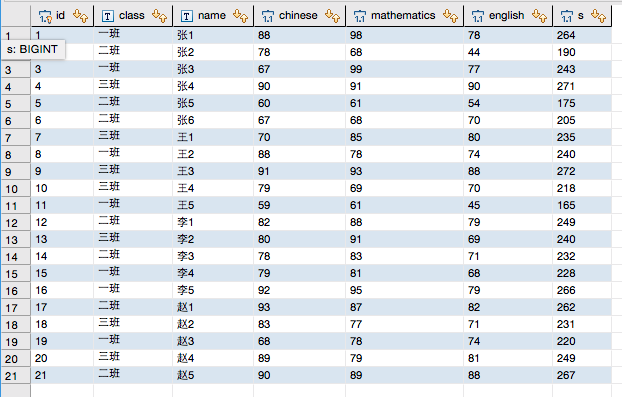
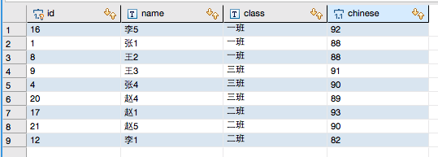
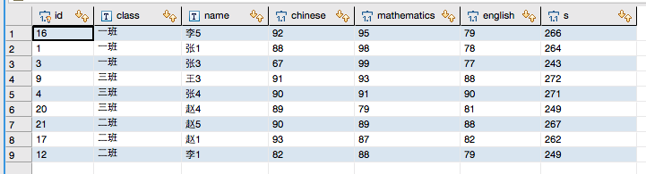

# MySQL查询之学生成绩表

	现有一张学生表(
		     id----编号,
		     name----姓名,
		     chinese----语文,
		     mathematics----数学,
		     english----英语,
		     class----班级
		)

需求：

1. 求每个班每位学生的总成绩；

	sql
		
		select students.id,students.class,students.name,students.chinese,students.mathematics,students.english,(chinese+mathematics+english)as s from students;
	
	
	
2. 求每个班语文成绩前三名的学生

	sql
		
		SELECT a.id,a.name,a.class,a.chinese FROM
		students a 
		LEFT JOIN 
		students b
		ON a.class=b.class AND a.chinese<=b.chinese
		GROUP BY a.id,a.class,a.chinese
		HAVING COUNT(b.id)<=3
		ORDER BY a.class,a.chinese desc;
	
	

3. 求每个班总成绩前三名的学生

	sql
	
		SELECT a.* FROM
		(select students.id,students.class,students.name,students.chinese,students.mathematics,students.english,(chinese+mathematics+english)as s from students) a 
		LEFT JOIN 
		(select students.id,students.class,students.name,students.chinese,students.mathematics,students.english,(chinese+mathematics+english)as s from students) b
		ON a.class=b.class AND a.s<=b.s
		GROUP BY a.id,a.class,a.s
		HAVING COUNT(b.id)<=3
		ORDER BY a.class,a.s desc;
	
	
	
	
	
	
	
	
	
	
	
	
	
	
	
	
	
	
	

